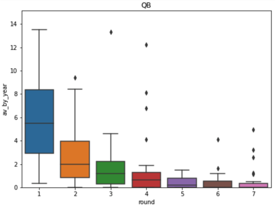
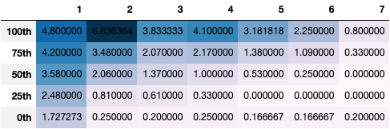

## 1. Introduction
I have decided to do an analysis of the NFL draft using AV(Approximate Value) per year. AV is a metric used by Pro Football Reference that tries to approximate value of a player in a season.  

> Created by PFR founder Doug Drinen, the Approximate Value (AV) method is an attempt to put a single number on the seasonal value of a player at any position from any year (since 1950).
> 
> -- <cite>[Pro Football Reference](https://www.pro-football-reference.com/blog/index37a8.html)</cite>

I've also decided to use AV by year instead of career AV because it would be unfair to players drafted recently. It does bring up some problems, for example:
- Chris Borland retired after one season despite being a quality starter. He has 6.0 AV by year which puts him next to Derrick Johnson, Brian Cushing and Brian Orakpo;
- Adrian Peterson was one of the best RBs of the century from 2008-2015 but he played until 2020 and that drags down his score. According to this metric he is near players like Eddie Lace and Melvin Gordon;

However I believe the gains outweights the losses. 

Other decision I made was to limit data from 2000 to 2017. The players on the most recent drafts don't have a big enough sample size and the older ones are not a good comparison because the game has changed a lot.

## 2. The expected and unexpected results according to round and position
### QB
As expected it's very hard to find great QBs outside of ther first round. You might still find some value in rounds 2 - 4 but you shouldn't draft a QB there and expect to find a superstar. 

Drew Brees, Russel Wilson and Dak Prescott are exceptions, not the rule.

QBs drafted in rounds 2 - 4 since 2015

Round 2:
- Jalen Hurts
- Drew Lock
- DeShone Kizer
- Christian Hackenberg

Round 3:
- Will Grier
- Mason Rudolph
- Davis Webb
- CJ Beathard
- Jacoby Brisset
- Cody Kessler
- Garrett Grayson
- Sean Mannion

Round 4:
- Jacob Eason
- James Morgan
- Ryan Finley
- Jarrett Stidham
- Kyle Lauletta
- Joshua Dobbs
- Connor Cook
- Dak Prescott (clear outlier)
- Cardale Jones
- Bryce Petty

### RB
It's one of the most stable positions through days 1 and 2. The floor may differ from round 1 to 2. It's interesting that day 3 has a high number of outliers.

If you don't have a starter look for players in day 2, it's not as expensive as round 1 and but it got a good hit rate. If you have a starter, keep taking flyers on day 3 and you will be able to find rotational pieces(Tarik Cohen, Latavius Murray, James White, ...) and future starters(Chris Carson, Devonta Freeman, Aaron Jones, ...).

### WR
This is the most normal distribution of all, the floor decreases as does the ceiling. As it is with RBs one of the most notable things is the number of outliers in day 3. The most notable players in day 3 are:

- Brandon Marshall (2006 4th)
- Steffon Diggs (2015 5th)
- Tyreek Hill (2016 5th)
- Antonio Brown (2010 6th)
- Marques Colston (2010 7th)

This include 3 of the best WRs of their generations in Brown, Hill and Diggs which is quite impressive.

### TE
This is weird, I'm going to lie but let's go. It's quite simple, DON'T DRAFT TEs IN ROUND 1 (Pitts would be my exception to this rule but he is 1/2 WR 1/2 TE). Using the metric the best TEs drafted in round 1:

- Jeremy Shockey (2002) - The best out of all the 1st rounders, 4x Pro Bowl, 1x First Team AP, 2x Super Bowl
- Dallas Clark (2003) - Great 11 year career, only 1x Pro Bowl
- Evan Engram (2017) - Not a bad player, not even close to the best, 1x Pro Bowl
- Dustin Keller (2008) - Consistent, never a great player, never 900+ yards in a season, no Pro Bowls

Now, the best TEs outside the first round:
- Travis Kelce (2013 3rd) - Future HOF
- Aaron Hernandez (2010 4th) - Clear off the field issues. When on the field he was good
- George Kittle (2017 5th) - If he continues producing like that he will be a first ballot HOF
- Rob Gronkwoski (2010 2nd) - Future first ballot HOF, top 3 TE in history
- Jimmy Graham (2010 3rd) - 5x Pro Bowls
- Zach Ertz (2013 2nd) - 3x Pro Bowls, 1x First Team AP, 1x Super Bowl
- Jeremichael Finley (2008 3rd) - Who?
- Jason Witten (2003 3rd) - Future HOF

Do I need to say anything else?

### OT
The first big suprise, the ceilling is quite high through rounds 1 to 4.

Round 1 is incredebly safe. There are only a few players that were unable to get into the field, in fact the only player drafted there that was unable to be a starter for even a year was Derek Sherrod(2011 30th by Green Bay). Only 4 other players were starters for less than 3 years: Jeff Otah, Gabe Carimi, Jason Smith and Cedric Ogbuehi.

Round 2 has more busts but it's still easy to find starters. In rounds 3 and 4 you can find a bit of everything, starters, busts and superstars.

The other rounds also have starting potential especially when compared to other positions. 

### iOL
The position is not as valued as most others positions in the offense - despite the OL performance being important to a NFL offense - so it's expected that the ceilling is one of the most stable. The 100th percentile at round 6 is 7.30 while at round 2 it's 7.10. Once again the big difference is the floor.

It's wise to keep taking flyers in day 3 no matter what. The risk is really low and you can keep your OL cheaper.

### DT
First of all, that little point in the first round above everyone else by a fair margin is Aaron Donald. He's that ridiculous.

Among the top 9 players, 7 were first rounders. As expected, there were only a few nose tackles in the first round, with most players being DTs in the mold of Donald or Suh.

There isn't much else to comment on here outside of the round 5 not following the trend. Looking at the players picked there you can see lots of nose tackles like Tyeler Davison and DJ Reader.

### DE
Among the 30 best players, 19 were drafted in the first round, including 10 in the first 11 picks. The best 4 were all drafted in the first round. 

After that it's quite stable for the next 3 rounds. Round 4 is incredible, the floor is incredibly high when compared to the earlier 2 as is the ceiling. The top players there were Elvis Dummervil, Trey Flowers, Za'Darius Smith, Everson Griffen and Jared Allen.

Being such an important position you should consider drafting one in the 1st round if you don't have an elite player in this position. If you have, round 4 seem to have great value for complementary pieces.

### LB
It's relatively easy to find startes in round 1 - 4. At a first glance round 1 seem to be the place to find superstars due to the number of outliers.

Among the seven best players according to the metric there are six 1st rounders(TJ Watt, Khalil Mack, Luke Kuechly, Patrick Willis, Von Miller and CJ Mosley, all outliers) and one 2nd rounder, Bobby Wagner

This however is a bit misleading, because among those 6 1st rounders there are 3 EDGEs. So lets look at the next 10 players:
- Telvin Smith (2014 5th)
- DeMarcus Ware (2005 1st) - EDGE
- NaVorro Bowman (2010 3rd)
- Lavonte David (2012 2nd)
- Lance Briggs (2003 3rd)
- Erick Kendricks (2015 2nd)
- Lofa Tatupu (2005 2nd)
- Odell Thurman (2005 2nd) - One year outlier
- Blake Martinez (2016 4th)
- Demario Davis (2012 3rd)

So the floor is still high but the ceiling is quite bad when compared to the following 3 rounds. If you absolutely need a LB draft one in the second round, otherwise go for one in the third or fourth.

### DB
Defensive backs are perharps one of the most top heavy position after the QBs.

Day 3 is stable, it's bad but it's stable. You should be happy if you are able to find starters there.

Day 2 is a mixed bag, you are able to find almost as many starters in these rounds as in day 1 but not many superstars. 

Choosing the limit value of a starter as 2 AV per year:
- Round 1: 88 players
- Round 2: 90 players
- Round 3: 54 players

Some of the players near the limit are Lamarcus Joyner, Jonathan Cyprien, Kevin King and Bradley Roby.

Day 1 is the gold mine, among the 17 best players, 13 are first rounders and there are several HOFs and future HOFs(Ed Reed, Polamalu, Revis, Jalen Ramsey, Patrick Peterson, Earl Thomas, ...).

## 3. Conclusions
- Finding great QBs outside the first round is one of the hardest jobs I can imagine;
- You can find starting WR, RB and iOL at any round. Sure it's easier to do it earlier but it's still possible later. If you have multiple late picks try to focus on those positions;
- If you want an elite DB, DE or DT (3 or 5 tech) look at the first round;
- Rounds in which I think teams should look for starters:
  - QB: round 1
  - RB: round 3
  - iOL: day 3
  - DT: round 5 (nose tackles)
  - DE: rounds 3 - 4
  - LB: rounds 2 - 4
  - DB: round 2
